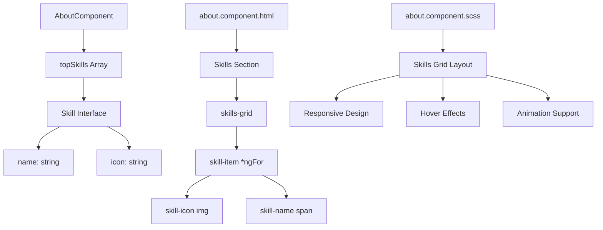
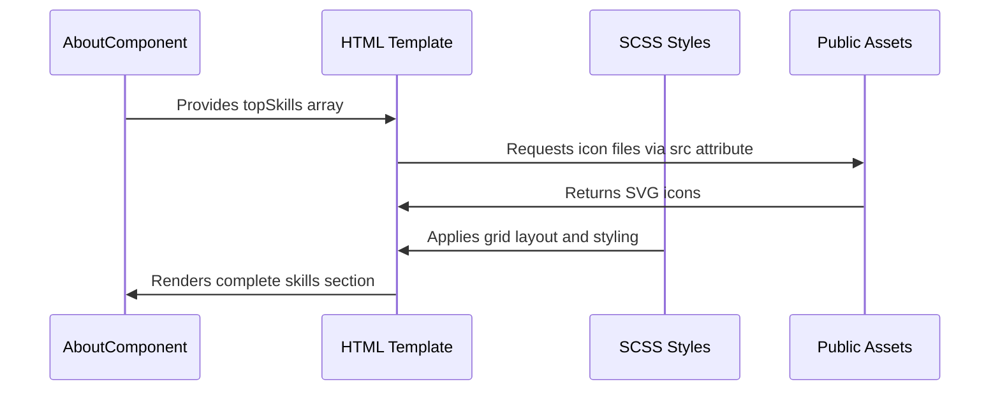

# Add Missing Technology Icons to Skills Section

## Overview

This design document outlines the implementation for adding missing technology icons to the "Principais Skills" section in the About component. The analysis reveals that several available icons in the public/icons directory are not currently being displayed in the skills section.

## Current State Analysis

### Currently Used Icons (8 icons)

- Angular (`icons/angular.svg`)
- TypeScript (`icons/typescript.svg`)
- C# (`icons/csharp-simple.svg`)
- ASP.NET Core (`icons/aspnet-core.svg`)
- JavaScript (`icons/javascript.svg`)
- Git (`icons/git.svg`)
- VB.NET (`icons/vbnet.svg`)
- SQL Server (`icons/sql.svg`)

### Available But Unused Icons (6 icons)

- Bootstrap (`icons/bootstrap.svg`)
- CSS3 (`icons/css3.svg`)
- HTML5 (`icons/html5.svg`)
- jQuery (`icons/jquery.svg`)
- Angular Material (`icons/devicon--angularmaterial.svg`)
- REST API (`icons/rest-api.svg`)

## Architecture

### Component Structure



### Data Flow



## Implementation Design

### 1. Data Model Extension

#### Current Skill Interface

```typescript
interface Skill {
  name: string;
  icon: string;
}
```

#### Enhanced Skills Array

The `topSkills` array in `AboutComponent` will be extended to include the missing technologies:

```typescript
topSkills: Skill[] = [
  // Current skills (8)
  { name: 'Angular', icon: 'icons/angular.svg' },
  { name: 'TypeScript', icon: 'icons/typescript.svg' },
  { name: 'C#', icon: 'icons/csharp-simple.svg' },
  { name: 'ASP.NET Core', icon: 'icons/aspnet-core.svg' },
  { name: 'JavaScript', icon: 'icons/javascript.svg' },
  { name: 'Git', icon: 'icons/git.svg' },
  { name: 'VB.NET', icon: 'icons/vbnet.svg' },
  { name: 'SQL Server', icon: 'icons/sql.svg' },

  // New skills to be added (6)
  { name: 'HTML5', icon: 'icons/html5.svg' },
  { name: 'CSS3', icon: 'icons/css3.svg' },
  { name: 'Bootstrap', icon: 'icons/bootstrap.svg' },
  { name: 'jQuery', icon: 'icons/jquery.svg' },
  { name: 'Angular Material', icon: 'icons/devicon--angularmaterial.svg' },
  { name: 'REST API', icon: 'icons/rest-api.svg' }
];
```

### 2. Responsive Grid Layout Analysis

#### Current Grid Configuration

- **Desktop (≥1024px)**: 3 columns → With 14 items: 5 rows (3+3+3+3+2)
- **Tablet (768px-1024px)**: 3 columns → With 14 items: 5 rows (3+3+3+3+2)
- **Mobile (≤768px)**: 2 columns → With 14 items: 7 rows (2+2+2+2+2+2+2)

#### Grid Layout Optimization

```scss
.skills-grid {
  display: grid;
  gap: var(--spacing-6);

  // Desktop: 3 columns for 14 items
  @media (min-width: 1024px) {
    grid-template-columns: repeat(3, 1fr);
  }

  // Tablet: 3 columns maintained
  @media (min-width: 768px) and (max-width: 1024px) {
    grid-template-columns: repeat(3, 1fr);
    gap: var(--spacing-5);
  }

  // Mobile: 2 columns for better mobile experience
  @media (max-width: 768px) {
    grid-template-columns: repeat(2, 1fr);
    gap: var(--spacing-4);
  }
}
```

### 3. Visual Design Considerations

#### Icon Consistency Standards

- **Size**: 48px × 48px (desktop), 40px × 40px (mobile)
- **Format**: SVG for scalability and performance
- **Styling**: Consistent drop-shadow and hover effects
- **Alignment**: Centered within skill cards

#### Hover Interaction Design

```scss
.skill-item {
  transition: all 0.3s cubic-bezier(0.4, 0, 0.2, 1);

  &:hover {
    transform: translateY(-4px);
    box-shadow: 0 12px 32px var(--shadow-color);
    border-color: var(--primary-color);

    .skill-icon {
      transform: scale(1.1);
    }

    .skill-name {
      color: var(--primary-color);
    }
  }
}
```

### 4. Animation Integration

#### AOS (Animate On Scroll) Configuration

Each new skill will maintain the existing staggered animation pattern:

```html
<div
  class="skill-item"
  *ngFor="let skill of topSkills; let i = index"
  data-aos="fade-up"
  [attr.data-aos-delay]="600 + i * 100"
></div>
```

- **Base delay**: 600ms
- **Increment**: 100ms per item
- **Total animation sequence**: 600ms → 1900ms (14 items)

## Technical Specifications

### Performance Considerations

- **SVG Optimization**: All icons are already optimized SVG files
- **Lazy Loading**: Icons load efficiently through Angular's change detection
- **Bundle Size**: Adding 6 small SVG files (~6KB total) has minimal impact

### Asset Management

- **Path Convention**: All icons use consistent `icons/filename.svg` pattern
- **Naming Convention**: Descriptive names matching technology brands
- **Directory Structure**: Icons stored in `public/icons/` for optimal Angular serving

### Accessibility Standards

- **Alt Text**: Each icon includes descriptive alt attribute
- **Semantic Markup**: Proper heading hierarchy maintained
- **Keyboard Navigation**: Focus management for interactive elements
- **Screen Readers**: Meaningful labels for assistive technology

```html

```

## Implementation Impact

### Visual Balance

- **Total Skills**: Increases from 8 to 14 items
- **Grid Distribution**: Better fills available space
- **Professional Appearance**: More comprehensive technology representation

### User Experience

- **Information Completeness**: Better showcases full technology stack
- **Visual Interest**: More varied and colorful icon set
- **Professional Credibility**: Demonstrates broader technical expertise

### Technical Skills Representation

- **Frontend Technologies**: HTML5, CSS3, Bootstrap, Angular, TypeScript, JavaScript, Angular Material, jQuery
- **Backend Technologies**: C#, ASP.NET Core, VB.NET, REST API
- **Database & Tools**: SQL Server, Git

## Testing Strategy

### Visual Verification

- Verify all 14 icons load correctly
- Confirm responsive behavior across breakpoints
- Test hover animations and transitions
- Validate accessibility features

### Cross-Browser Compatibility

- Chrome, Firefox, Safari, Edge
- Mobile browsers (iOS Safari, Chrome Mobile)
- Ensure SVG rendering consistency

### Performance Validation

- Monitor bundle size impact
- Verify loading performance
- Test animation smoothness
