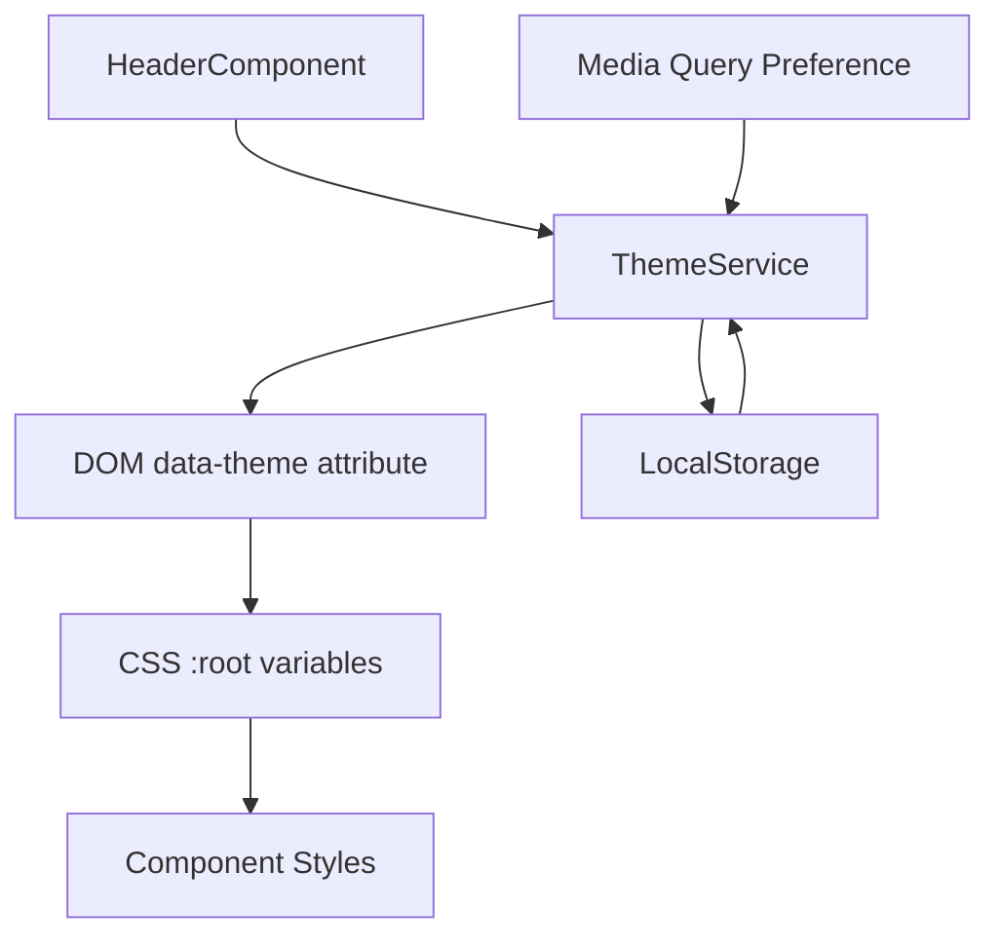
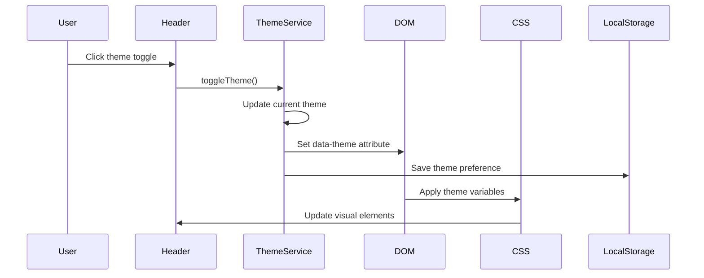
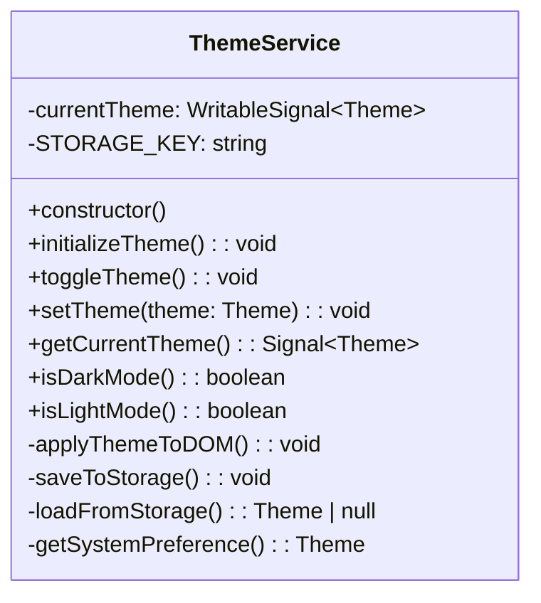
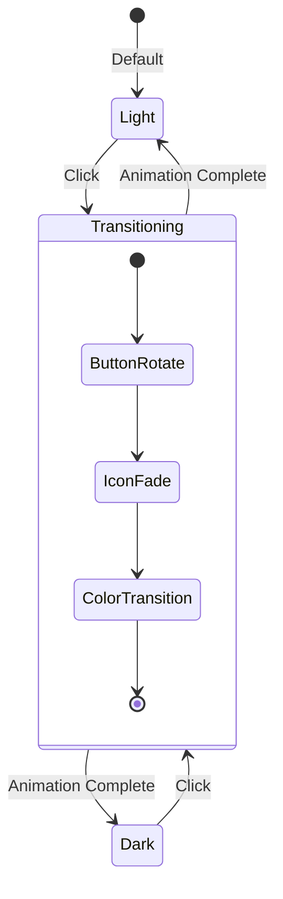

# Site Theme Toggle Fix and Color Palette Update

## Overview

This design addresses the non-functional theme toggle button in the Angular portfolio application and introduces a new, more attractive color palette. The current theme toggle button exists in the header but fails to properly switch between light and dark modes due to implementation issues in the theme service and CSS variable system.

## Current Issues Identified

### Theme Toggle Functionality Problems

1. **Incomplete Theme Service Implementation**

   - Effect function for DOM updates is commented out
   - Theme initialization method is not called
   - No proper localStorage persistence
   - Missing data-theme attribute update

2. **CSS Theme Variables Structure**
   - Limited color palette (only basic blue/yellow theme)
   - No comprehensive component theming
   - Missing visual feedback for theme transitions

## Architecture

### Component Structure



### Theme System Flow



## Enhanced Color Palette System

### Modern Color Schemes

#### Light Theme

```
Primary Colors:
--primary-color: #6366f1 (Modern indigo)
--secondary-color: #10b981 (Emerald green)
--accent-color: #f59e0b (Amber)

Background Colors:
--background-color: #ffffff
--surface-color: #f8fafc
--surface-elevated: #ffffff

Text Colors:
--text-primary: #0f172a
--text-secondary: #475569
--text-muted: #94a3b8

Border & Shadow:
--border-color: #e2e8f0
--border-light: #f1f5f9
--shadow-color: rgba(0, 0, 0, 0.08)
```

#### Dark Theme

```
Primary Colors:
--primary-color: #818cf8 (Light indigo)
--secondary-color: #34d399 (Light emerald)
--accent-color: #fbbf24 (Light amber)

Background Colors:
--background-color: #0f172a
--surface-color: #1e293b
--surface-elevated: #334155

Text Colors:
--text-primary: #f1f5f9
--text-secondary: #cbd5e1
--text-muted: #64748b

Border & Shadow:
--border-color: #334155
--border-light: #475569
--shadow-color: rgba(0, 0, 0, 0.25)
```

## Theme Service Implementation

### Enhanced Service Structure

| Method              | Purpose                                      | Implementation                                    |
| ------------------- | -------------------------------------------- | ------------------------------------------------- |
| `initializeTheme()` | Load saved theme or detect system preference | Check localStorage, fallback to system preference |
| `toggleTheme()`     | Switch between light/dark modes              | Update signal and trigger effects                 |
| `setTheme(theme)`   | Set specific theme                           | Update signal and persist                         |
| `getCurrentTheme()` | Get current theme as readonly signal         | Return computed signal                            |
| `applyThemeToDOM()` | Update DOM with theme changes                | Set data-theme attribute                          |

### Service Architecture



## CSS Variables Enhancement

### Theme Variable Structure

| Category       | Light Mode | Dark Mode | Usage                      |
| -------------- | ---------- | --------- | -------------------------- |
| Primary        | #6366f1    | #818cf8   | Buttons, links, highlights |
| Secondary      | #10b981    | #34d399   | Success states, accents    |
| Background     | #ffffff    | #0f172a   | Page background            |
| Surface        | #f8fafc    | #1e293b   | Card backgrounds           |
| Text Primary   | #0f172a    | #f1f5f9   | Main content text          |
| Text Secondary | #475569    | #cbd5e1   | Supporting text            |

### Animation & Transition System

```css
/* Smooth theme transitions */
* {
  transition: background-color 0.3s cubic-bezier(0.4, 0, 0.2, 1), border-color 0.3s cubic-bezier(0.4, 0, 0.2, 1),
    color 0.3s cubic-bezier(0.4, 0, 0.2, 1), box-shadow 0.3s cubic-bezier(0.4, 0, 0.2, 1);
}
```

## Component Updates Required

### Header Component Enhancements

#### Theme Toggle Button Improvements

- Enhanced visual feedback (rotation animation)
- Better accessibility with ARIA labels
- Smooth icon transitions
- Loading state during theme switch

#### Visual Design Updates

```
Button States:
- Default: Subtle border with theme colors
- Hover: Scale transform + color change
- Active: Pressed state with shadow
- Focus: Keyboard navigation outline
```

### Global Component Theming

#### Components Requiring Theme Support

| Component    | Theme Properties                   | Priority |
| ------------ | ---------------------------------- | -------- |
| Header       | Background, text, border           | High     |
| Home         | Background, text, button colors    | High     |
| About        | Background, text, card surface     | Medium   |
| Projects     | Card backgrounds, borders, shadows | High     |
| Technologies | Badge colors, backgrounds          | Medium   |
| Footer       | Background, text, link colors      | Low      |

## Implementation Strategy

### Phase 1: Theme Service Fix

1. Uncomment and enhance effect function
2. Add proper initialization call
3. Implement localStorage persistence
4. Add DOM attribute updates

### Phase 2: Color Palette Update

1. Update CSS variables with new color scheme
2. Ensure accessibility compliance (WCAG contrast ratios)
3. Test color combinations across all components

### Phase 3: Component Integration

1. Update component styles to use new variables
2. Add theme transition animations
3. Implement theme-aware icons and graphics

### Phase 4: User Experience Enhancement

1. Add theme preference detection
2. Implement smooth transitions
3. Add loading states during theme changes
4. Enhance accessibility features

## Theme Transition Animations

### Button Animation States



## Testing Strategy

### Theme Toggle Testing

1. **Functionality Tests**

   - Theme persistence across page reloads
   - System preference detection
   - Manual toggle functionality
   - LocalStorage integration

2. **Visual Tests**

   - Color contrast validation
   - Component appearance in both themes
   - Animation smoothness
   - Responsive behavior

3. **Accessibility Tests**
   - Keyboard navigation
   - Screen reader compatibility
   - Color contrast ratios
   - Focus states visibility

## Browser Compatibility

### CSS Features Support

- CSS Variables (Custom Properties): All modern browsers
- CSS Grid & Flexbox: Full support
- CSS Transitions: Universal support
- `prefers-color-scheme`: Modern browsers (graceful degradation)

### Fallback Strategy

- Default to light theme if CSS variables unsupported
- Progressive enhancement for advanced features
- Graceful degradation for older browsers
