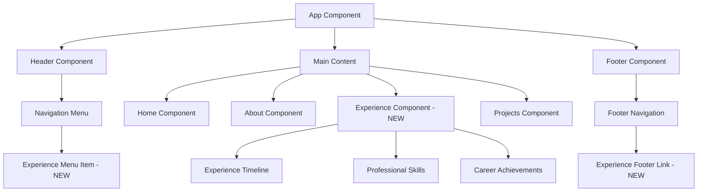

# Professional Experience Section Design

## Overview

This design document outlines the transformation of the current professional experience timeline (currently embedded within the About section sidebar) into a dedicated standalone section. This new section will be integrated into the portfolio navigation structure, appearing in both the header menu and footer navigation, providing users with direct access to detailed professional experience information.

## Requirements Analysis

### Current State

- Professional experience is currently displayed as a timeline within the About section sidebar
- Experience data includes: year, title, company, and description
- Limited space restricts the amount of detail that can be displayed
- No direct navigation access to experience information

### Proposed Enhancement

- Create a dedicated "Experiência" section with its own component
- Integrate section into header and footer navigation menus
- Enhance experience display with more detailed information and improved visual presentation
- Maintain responsive design principles across all device sizes

## Architecture

### Component Structure



### Data Model Enhancement

```typescript
interface Experience {
  id: string;
  year: string;
  title: string;
  company: string;
  companyUrl?: string;
  location: string;
  duration: string;
  description: string;
  responsibilities: string[];
  technologies: Technology[];
  achievements: string[];
  type: 'full-time' | 'part-time' | 'freelance' | 'internship';
  current: boolean;
}

interface Technology {
  name: string;
  category: 'frontend' | 'backend' | 'database' | 'tools' | 'cloud';
  icon: string;
}

interface Achievement {
  title: string;
  description: string;
  impact?: string;
  metrics?: string;
}
```

## Component Design

### Experience Component Structure

```html
<section id="experience" class="experience-section">
  <div class="container">
    <!-- Section Header -->
    <div class="section-header" data-aos="fade-up">
      <span class="section-subtitle">Minha Jornada</span>
      <h2 class="section-title">Experiência Profissional</h2>
      <p class="section-description">
        Uma visão detalhada da minha trajetória profissional e evolução como desenvolvedor
      </p>
    </div>

    <div class="experience-content">
      <!-- Timeline Section -->
      <div class="experience-timeline" data-aos="fade-right">
        <!-- Enhanced timeline with detailed cards -->
      </div>

      <!-- Skills & Stats Sidebar -->
      <div class="experience-sidebar" data-aos="fade-left">
        <!-- Professional skills -->
        <!-- Career statistics -->
        <!-- Certifications -->
      </div>
    </div>
  </div>
</section>
```

### Enhanced Timeline Card Design

```html
<div class="timeline-item" *ngFor="let exp of experiences; let i = index">
  <div class="timeline-marker">
    <div class="timeline-icon">
      <svg><!-- Career icon --></svg>
    </div>
    <div class="timeline-line" *ngIf="i < experiences.length - 1"></div>
  </div>

  <div class="timeline-content">
    <div class="experience-card">
      <div class="card-header">
        <div class="experience-meta">
          <span class="experience-year">{{ exp.year }}</span>
          <span class="experience-duration">{{ exp.duration }}</span>
          <span class="experience-type" [class]="exp.type">{{ exp.type | titlecase }}</span>
        </div>
        <div class="experience-current" *ngIf="exp.current">
          <span class="current-badge">Atual</span>
        </div>
      </div>

      <div class="card-body">
        <h3 class="experience-title">{{ exp.title }}</h3>
        <div class="company-info">
          <a
            *ngIf="exp.companyUrl; else companyText"
            [href]="exp.companyUrl"
            target="_blank"
            class="company-link"
          >
            {{ exp.company }}
          </a>
          <ng-template #companyText>
            <span class="company-name">{{ exp.company }}</span>
          </ng-template>
          <span class="location">{{ exp.location }}</span>
        </div>

        <p class="experience-description">{{ exp.description }}</p>

        <div class="responsibilities" *ngIf="exp.responsibilities.length">
          <h4>Principais Responsabilidades:</h4>
          <ul>
            <li *ngFor="let responsibility of exp.responsibilities">{{ responsibility }}</li>
          </ul>
        </div>

        <div class="achievements" *ngIf="exp.achievements.length">
          <h4>Conquistas:</h4>
          <ul class="achievements-list">
            <li *ngFor="let achievement of exp.achievements" class="achievement-item">
              {{ achievement }}
            </li>
          </ul>
        </div>

        <div class="technologies" *ngIf="exp.technologies.length">
          <h4>Tecnologias Utilizadas:</h4>
          <div class="tech-stack">
            <span *ngFor="let tech of exp.technologies" class="tech-tag" [class]="tech.category">
              
              {{ tech.name }}
            </span>
          </div>
        </div>
      </div>
    </div>
  </div>
</div>
```

## Navigation Integration

### Header Navigation Enhancement

```html
<!-- Updated header navigation in header.component.html -->
<ul class="nav-menu" [class.active]="isMenuOpen">
  <li>
    <a href="#" (click)="scrollToSection('home')" [class.active]="activeSection === 'home'">Home</a>
  </li>
  <li>
    <a href="#" (click)="scrollToSection('about')" [class.active]="activeSection === 'about'"
      >Sobre</a
    >
  </li>
  <li>
    <a
      href="#"
      (click)="scrollToSection('experience')"
      [class.active]="activeSection === 'experience'"
      >Experiência</a
    >
  </li>
  <li>
    <a href="#" (click)="scrollToSection('projects')" [class.active]="activeSection === 'projects'"
      >Projetos</a
    >
  </li>
</ul>
```

### Footer Navigation Enhancement

```html
<!-- Updated footer navigation in footer.component.html -->
<div class="footer-links" data-aos="fade-up" data-aos-delay="700">
  <h4 class="section-title">
    <svg
      width="20"
      height="20"
      viewBox="0 0 24 24"
      fill="none"
      stroke="currentColor"
      stroke-width="2"
    >
      <path d="M3 9l9-7 9 7v11a2 2 0 0 1-2 2H5a2 2 0 0 1-2-2z" />
      <polyline points="9,22 9,12 15,12 15,22" />
    </svg>
    Navegação
  </h4>
  <ul class="links-list">
    <li><a href="#" (click)="scrollToSection('home')" class="footer-link">Início</a></li>
    <li><a href="#" (click)="scrollToSection('about')" class="footer-link">Sobre</a></li>
    <li><a href="#" (click)="scrollToSection('experience')" class="footer-link">Experiência</a></li>
    <li><a href="#" (click)="scrollToSection('projects')" class="footer-link">Projetos</a></li>
  </ul>
</div>
```

## Layout & Styling

### Responsive Design Strategy

```scss
.experience-section {
  padding: 5rem 0;
  background: var(--section-background);

  .experience-content {
    display: grid;
    grid-template-columns: 1fr 300px;
    gap: 3rem;
    margin-top: 3rem;

    @media (max-width: 968px) {
      grid-template-columns: 1fr;
      gap: 2rem;
    }
  }
}

.experience-timeline {
  position: relative;

  .timeline-item {
    display: grid;
    grid-template-columns: 60px 1fr;
    gap: 2rem;
    margin-bottom: 3rem;

    @media (max-width: 768px) {
      grid-template-columns: 40px 1fr;
      gap: 1rem;
      margin-bottom: 2rem;
    }
  }
}

.experience-card {
  background: var(--card-background);
  border: 1px solid var(--border-color);
  border-radius: 12px;
  padding: 2rem;
  box-shadow: var(--card-shadow);
  transition: all 0.3s ease;

  &:hover {
    transform: translateY(-4px);
    box-shadow: var(--card-shadow-hover);
  }

  @media (max-width: 768px) {
    padding: 1.5rem;
  }
}
```

### Animation Integration

```scss
.timeline-item {
  opacity: 0;
  transform: translateX(-50px);

  &[data-aos='fade-right'] {
    &.aos-animate {
      opacity: 1;
      transform: translateX(0);
    }
  }
}

.experience-card {
  transition: all 0.3s cubic-bezier(0.4, 0, 0.2, 1);

  &:hover {
    .timeline-marker .timeline-icon {
      background: var(--primary-color);
      color: white;
      transform: scale(1.1);
    }
  }
}
```

## Service Integration

### Scroll Service Enhancement

```typescript
// scroll.service.ts - Add experience section
export class ScrollService {
  private sections = ['home', 'about', 'experience', 'projects'];

  scrollToSection(sectionId: string): void {
    const element = document.getElementById(sectionId);
    if (element) {
      const headerHeight = this.getHeaderHeight();
      const targetPosition = element.offsetTop - headerHeight;

      window.scrollTo({
        top: targetPosition,
        behavior: 'smooth',
      });
    }
  }

  getCurrentSection(): string {
    const scrollPosition = window.pageYOffset + this.getHeaderHeight() + 100;

    for (const sectionId of this.sections.reverse()) {
      const section = document.getElementById(sectionId);
      if (section && section.offsetTop <= scrollPosition) {
        return sectionId;
      }
    }

    return 'home';
  }
}
```

### Data Service for Experience

```typescript
// experience.service.ts
@Injectable({
  providedIn: 'root',
})
export class ExperienceService {
  private experiences: Experience[] = [
    {
      id: '1',
      year: '2024',
      title: 'Desenvolvedor Full Stack Sênior',
      company: 'Tech Innovation Ltd.',
      companyUrl: 'https://techinnovation.com',
      location: 'São Paulo, SP',
      duration: '8 meses',
      description: 'Liderança técnica em projetos de grande escala utilizando Angular e .NET Core.',
      responsibilities: [
        'Arquitetura e desenvolvimento de aplicações web complexas',
        'Mentoria de desenvolvedores juniores',
        'Implementação de práticas DevOps e CI/CD',
        'Otimização de performance e escalabilidade',
      ],
      technologies: [
        { name: 'Angular', category: 'frontend', icon: 'assets/icons/angular.svg' },
        { name: '.NET Core', category: 'backend', icon: 'assets/icons/dotnet.svg' },
        { name: 'Azure', category: 'cloud', icon: 'assets/icons/azure.svg' },
      ],
      achievements: [
        'Reduziu tempo de carregamento em 40%',
        'Implementou arquitetura de microserviços',
        'Liderou equipe de 5 desenvolvedores',
      ],
      type: 'full-time',
      current: true,
    },
    // Additional experience entries...
  ];

  getExperiences(): Observable<Experience[]> {
    return of(this.experiences);
  }

  getCurrentExperience(): Observable<Experience | null> {
    const current = this.experiences.find((exp) => exp.current);
    return of(current || null);
  }
}
```

## About Section Refactoring

### Updated About Component Structure

```html
<!-- Simplified about.component.html without experience timeline -->
<section id="about" class="about-section">
  <div class="container">
    <div class="section-header" data-aos="fade-up">
      <span class="section-subtitle">Conheça mais sobre mim</span>
      <h2 class="section-title">Sobre Antonio Romes</h2>
      <p class="section-description">
        Desenvolvedor apaixonado por criar experiências digitais excepcionais
      </p>
    </div>

    <div class="about-content">
      <div class="about-main" data-aos="fade-right">
        <!-- Personal introduction -->
        <!-- Values and principles -->
        <!-- Call-to-action buttons -->
      </div>

      <div class="about-sidebar" data-aos="fade-left">
        <!-- Skills section -->
        <!-- Quick statistics -->
        <!-- Personal interests -->
      </div>
    </div>
  </div>
</section>
```

## Testing Strategy

### Unit Testing

```typescript
// experience.component.spec.ts
describe('ExperienceComponent', () => {
  let component: ExperienceComponent;
  let fixture: ComponentFixture<ExperienceComponent>;
  let experienceService: jasmine.SpyObj<ExperienceService>;

  beforeEach(() => {
    const spy = jasmine.createSpyObj('ExperienceService', ['getExperiences']);

    TestBed.configureTestingModule({
      imports: [ExperienceComponent],
      providers: [{ provide: ExperienceService, useValue: spy }],
    });

    fixture = TestBed.createComponent(ExperienceComponent);
    component = fixture.componentInstance;
    experienceService = TestBed.inject(ExperienceService) as jasmine.SpyObj<ExperienceService>;
  });

  it('should load experiences on init', () => {
    const mockExperiences: Experience[] = [
      // Mock data
    ];

    experienceService.getExperiences.and.returnValue(of(mockExperiences));

    component.ngOnInit();

    expect(component.experiences).toEqual(mockExperiences);
    expect(experienceService.getExperiences).toHaveBeenCalled();
  });

  it('should render timeline items correctly', () => {
    component.experiences = [
      /* mock data */
    ];
    fixture.detectChanges();

    const timelineItems = fixture.debugElement.queryAll(By.css('.timeline-item'));
    expect(timelineItems.length).toBe(component.experiences.length);
  });
});
```

## Implementation Plan

### Phase 1: Component Creation

1. Generate experience component using Angular CLI
2. Create experience service for data management
3. Implement basic timeline structure
4. Add responsive styling foundation

### Phase 2: Navigation Integration

1. Update header navigation component
2. Update footer navigation component
3. Enhance scroll service for new section
4. Test navigation functionality across devices

### Phase 3: Content Enhancement

1. Implement detailed experience cards
2. Add technology stack visualization
3. Include achievements and metrics
4. Integrate AOS animations

### Phase 4: About Section Refactoring

1. Remove experience timeline from About component
2. Reorganize About section layout
3. Update About component styling
4. Ensure content hierarchy remains logical

### Phase 5: Testing & Optimization

1. Write comprehensive unit tests
2. Perform cross-browser testing
3. Optimize performance and accessibility
4. Validate responsive behavior

## Accessibility Considerations

```html
<!-- Semantic HTML structure -->
<section id="experience" role="main" aria-labelledby="experience-title">
  <h2 id="experience-title" class="section-title">Experiência Profissional</h2>

  <div class="experience-timeline" role="list" aria-label="Timeline de experiências profissionais">
    <div class="timeline-item" role="listitem" *ngFor="let exp of experiences">
      <!-- Proper heading hierarchy -->
      <h3 class="experience-title">{{ exp.title }}</h3>

      <!-- Accessible links -->
      <a
        [href]="exp.companyUrl"
        [attr.aria-label]="'Visitar site da empresa ' + exp.company"
        target="_blank"
        rel="noopener noreferrer"
      >
        {{ exp.company }}
      </a>

      <!-- Screen reader friendly content -->
      <div class="sr-only">
        Experiência de {{ exp.duration }} como {{ exp.title }} na empresa {{ exp.company }}
      </div>
    </div>
  </div>
</section>
```

## Performance Optimization

### Lazy Loading Strategy

```typescript
// experience.component.ts
export class ExperienceComponent implements OnInit {
  @Input() lazy = true;

  ngOnInit() {
    if (this.lazy) {
      this.loadExperiencesOnScroll();
    } else {
      this.loadExperiences();
    }
  }

  private loadExperiencesOnScroll() {
    const observer = new IntersectionObserver((entries) => {
      if (entries[0].isIntersecting) {
        this.loadExperiences();
        observer.disconnect();
      }
    });

    observer.observe(this.elementRef.nativeElement);
  }
}
```

### Bundle Optimization

- Use OnPush change detection strategy
- Implement trackBy functions for \*ngFor loops
- Optimize images with WebP format and lazy loading
- Minimize CSS bundle size with unused code elimination
