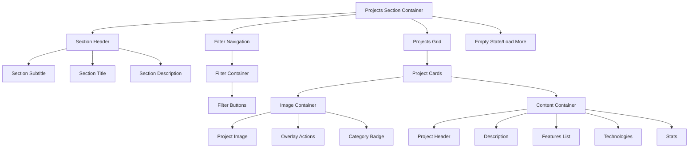

# Project Section Layout Enhancement Design

## Overview

This design document outlines improvements for the projects section to properly separate and organize visual elements, addressing the current issue where all elements appear clustered together without clear visual separation. The solution focuses on enhancing spacing, visual hierarchy, and component organization to create a more professional and readable layout.

## Current Issues Analysis

### Layout Problems Identified

- **Insufficient Visual Separation**: Project cards, filter buttons, and content elements lack proper spacing
- **Crowded Interface**: Elements appear too close together, creating visual clutter
- **Poor Content Hierarchy**: Difficulty distinguishing between different content sections within cards
- **Inconsistent Spacing**: Varying gaps between similar UI components
- **Responsive Layout Issues**: Elements may overlap or crowd on smaller screens

### Root Causes

- Missing margin/padding definitions in component styles
- Inadequate grid gap configuration in projects-grid
- Lack of visual separators between content sections
- Insufficient responsive breakpoint handling

## Architecture Enhancement

### Component Structure Refinement



### Spacing System Design

#### Spacing Token Hierarchy

- **Micro Spacing**: 4px - Internal component padding
- **Small Spacing**: 8px - Between related elements
- **Medium Spacing**: 16px - Between component sections
- **Large Spacing**: 24px - Between major components
- **Extra Large Spacing**: 32px - Between sections

#### Visual Separation Techniques

1. **Whitespace Management**: Strategic use of margins and padding
2. **Border Separators**: Subtle dividers between content sections
3. **Background Variants**: Different surface colors for visual grouping
4. **Shadow Depth**: Elevation to create visual hierarchy

## Layout Improvements

### Grid System Enhancement

#### Projects Grid Refinement

```scss
.projects-grid {
  display: grid;
  grid-template-columns: repeat(auto-fit, minmax(380px, 1fr));
  gap: 2rem; // Increased from current spacing
  padding: 1.5rem 0;

  @media (max-width: 768px) {
    grid-template-columns: 1fr;
    gap: 1.5rem;
    padding: 1rem 0;
  }

  @media (min-width: 1200px) {
    grid-template-columns: repeat(3, 1fr);
    gap: 2.5rem;
  }
}
```

#### Filter Navigation Spacing

```scss
.filter-navigation {
  margin: 3rem 0;

  .filter-container {
    display: flex;
    justify-content: center;
    gap: 1rem;
    flex-wrap: wrap;
    padding: 1rem;

    @media (max-width: 640px) {
      gap: 0.75rem;
    }
  }
}
```

### Card Component Restructure

#### Enhanced Card Layout

```scss
.project-card {
  background: var(--surface-color);
  border-radius: 16px;
  border: 1px solid var(--border-color);
  overflow: hidden;
  transition: all 0.3s ease;
  min-height: 520px; // Ensure consistent height
  display: flex;
  flex-direction: column;

  .project-image-container {
    height: 220px; // Fixed height for consistency
    position: relative;
    overflow: hidden;
  }

  .project-content {
    flex: 1;
    padding: 1.5rem;
    display: flex;
    flex-direction: column;
    gap: 1rem;
  }
}
```

#### Content Section Organization

```scss
.project-header {
  border-bottom: 1px solid var(--border-light);
  padding-bottom: 1rem;
  margin-bottom: 1rem;
}

.project-features {
  background: var(--surface-secondary);
  padding: 1rem;
  border-radius: 8px;
  margin: 1rem 0;
}

.project-technologies {
  margin-top: auto; // Push to bottom
  padding-top: 1rem;
  border-top: 1px solid var(--border-light);
}
```

### Visual Separation Enhancements

#### Section Headers

```scss
.section-header {
  text-align: center;
  margin-bottom: 4rem;

  .section-subtitle {
    display: block;
    color: var(--primary-color);
    font-weight: 600;
    font-size: 0.875rem;
    text-transform: uppercase;
    letter-spacing: 1px;
    margin-bottom: 0.5rem;
  }

  .section-title {
    font-size: 2.5rem;
    color: var(--text-primary);
    margin-bottom: 1rem;
    position: relative;

    &::after {
      content: '';
      position: absolute;
      bottom: -0.5rem;
      left: 50%;
      transform: translateX(-50%);
      width: 60px;
      height: 3px;
      background: var(--primary-color);
    }
  }

  .section-description {
    color: var(--text-secondary);
    max-width: 600px;
    margin: 0 auto;
    line-height: 1.6;
  }
}
```

#### Filter Button Improvements

```scss
.filter-btn {
  padding: 0.75rem 1.5rem;
  background: transparent;
  border: 2px solid var(--border-color);
  border-radius: 25px;
  color: var(--text-secondary);
  font-weight: 500;
  cursor: pointer;
  transition: all 0.3s ease;
  display: flex;
  align-items: center;
  gap: 0.5rem;
  min-width: 120px;
  justify-content: center;

  &:hover {
    border-color: var(--primary-color);
    color: var(--primary-color);
    transform: translateY(-2px);
    box-shadow: 0 4px 12px rgba(37, 99, 235, 0.2);
  }

  &.active {
    background: var(--primary-color);
    border-color: var(--primary-color);
    color: white;
    box-shadow: 0 4px 12px rgba(37, 99, 235, 0.3);
  }
}
```

## Content Organization

### Card Content Hierarchy

#### Header Section Structure

```scss
.project-header {
  .project-title {
    font-size: 1.25rem;
    font-weight: 600;
    color: var(--text-primary);
    margin-bottom: 0.5rem;
    line-height: 1.3;
  }

  .project-meta {
    display: flex;
    justify-content: space-between;
    align-items: center;

    .project-year {
      color: var(--text-tertiary);
      font-size: 0.875rem;
    }

    .project-difficulty {
      display: flex;
      align-items: center;
      gap: 0.25rem;
      font-size: 0.75rem;
      color: var(--text-tertiary);
    }
  }
}
```

#### Features and Technologies Layout

```scss
.project-features {
  .features-title {
    font-size: 0.875rem;
    font-weight: 600;
    color: var(--text-primary);
    margin-bottom: 0.75rem;
  }

  .features-list {
    list-style: none;
    padding: 0;
    margin: 0;

    .feature-item {
      display: flex;
      align-items: center;
      gap: 0.5rem;
      padding: 0.25rem 0;
      color: var(--text-secondary);
      font-size: 0.875rem;

      svg {
        color: var(--success-color);
        flex-shrink: 0;
      }
    }
  }
}

.project-technologies {
  .tech-title {
    font-size: 0.875rem;
    font-weight: 600;
    color: var(--text-primary);
    margin-bottom: 0.75rem;
  }

  .tech-stack {
    display: flex;
    flex-wrap: wrap;
    gap: 0.5rem;

    .tech-tag {
      background: var(--primary-color-light);
      color: var(--primary-color);
      padding: 0.375rem 0.75rem;
      border-radius: 20px;
      font-size: 0.75rem;
      font-weight: 500;
      display: flex;
      align-items: center;
      gap: 0.25rem;

      .tech-icon {
        width: 16px;
        height: 16px;
      }
    }
  }
}
```

## Responsive Behavior

### Breakpoint Strategy

#### Mobile (< 640px)

- Single column grid layout
- Reduced card padding and spacing
- Stacked filter buttons with minimal gaps
- Simplified card content hierarchy

#### Tablet (640px - 1024px)

- Two column grid layout
- Standard spacing and padding
- Wrap filter buttons to multiple rows
- Full card content display

#### Desktop (> 1024px)

- Three column grid layout
- Maximum spacing for visual clarity
- Single row filter navigation
- Enhanced hover interactions

### Mobile Layout Adjustments

```scss
@media (max-width: 640px) {
  .section-header {
    margin-bottom: 2rem;

    .section-title {
      font-size: 2rem;
    }
  }

  .filter-navigation {
    margin: 2rem 0;

    .filter-container {
      gap: 0.5rem;
      padding: 0.5rem;
    }

    .filter-btn {
      padding: 0.5rem 1rem;
      min-width: auto;
      flex: 1;
    }
  }

  .projects-grid {
    gap: 1.5rem;
  }

  .project-card {
    .project-content {
      padding: 1rem;
      gap: 0.75rem;
    }
  }
}
```

## Performance Considerations

### Layout Optimization

- Use CSS Grid for better performance than Flexbox for large grids
- Implement `contain` property for isolated rendering
- Optimize image loading with proper aspect ratios
- Use `transform` for animations instead of layout properties

### Animation Performance

```scss
.project-card {
  contain: layout style paint;
  will-change: transform;

  &:hover {
    transform: translateY(-8px) scale(1.02);
  }
}
```

## Testing Strategy

### Visual Regression Testing

- Screenshot comparison across different viewport sizes
- Card layout consistency verification
- Filter button alignment testing
- Spacing measurement validation

### User Experience Testing

- Navigation flow through filter categories
- Card hover interaction responsiveness
- Mobile touch interaction accuracy
- Accessibility compliance verification

### Performance Testing

- Layout shift measurement during content loading
- Animation frame rate monitoring
- Memory usage optimization
- Bundle size impact assessment
