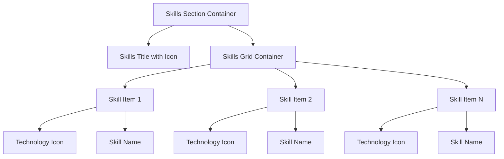

# Skills Section Enhancement: Remove Percentages and Add Technology Icons

## Overview

This design outlines the enhancement of the "Principais Skills" section in the About component by removing percentage-based skill levels and replacing them with a clean, icon-focused design. The current implementation displays skills with percentage indicators and progress bars, which will be transformed into a modern, minimalist grid layout showcasing technology icons without quantitative assessments.

## Current Implementation Analysis

### Current Structure

- **Location**: About component (`src/app/components/about/`)
- **Data Structure**: Array of skills with `name`, `level` (percentage), and `icon` properties
- **Visual Design**: Cards with skill name, icon, percentage, and animated progress bars
- **Layout**: Responsive grid using CSS Grid with auto-fit columns

### Current Skills Data

```typescript
topSkills: Skill[] = [
  { name: 'Angular', level: 95, icon: 'assets/icons/angular.svg' },
  { name: 'TypeScript', level: 90, icon: 'assets/icons/typescript.svg' },
  { name: 'C# .NET', level: 85, icon: 'assets/icons/csharp.svg' },
  { name: 'JavaScript', level: 90, icon: 'assets/icons/javascript.svg' },
  { name: 'SQL Server', level: 80, icon: 'assets/icons/sql.svg' },
  { name: 'HTML/CSS', level: 95, icon: 'assets/icons/html.svg' }
];
```

## Design Requirements

### Functional Requirements

1. **Remove Percentage Display**: Eliminate all percentage-based skill level indicators
2. **Remove Progress Bars**: Remove animated progress bar components
3. **Enhance Icon Presentation**: Improve technology icon visibility and styling
4. **Maintain Responsive Design**: Preserve current responsive behavior across devices
5. **Keep AOS Animations**: Maintain existing scroll animations for visual continuity

### Visual Requirements

1. **Clean Icon Grid**: Display skills as a clean grid of technology icons with names
2. **Hover Effects**: Implement subtle hover interactions for better user engagement
3. **Consistent Sizing**: Standardize icon sizes across all technologies
4. **Modern Typography**: Enhance skill name presentation
5. **Theme Compatibility**: Maintain compatibility with existing light/dark theme system

## Component Architecture

### Data Model Transformation

#### Current Interface

```typescript
interface Skill {
  name: string;
  level: number; // To be removed
  icon: string;
}
```

#### New Interface

```typescript
interface Skill {
  name: string;
  icon: string;
  category?: string; // Optional: for grouping/styling
}
```

### Layout Architecture

#### New Grid Structure



## Visual Design Specifications

### Grid Layout

- **Desktop**: 3 columns with equal spacing
- **Tablet**: 2 columns with adjusted spacing
- **Mobile**: 2 columns with compact spacing
- **Gap**: Consistent spacing using CSS custom properties

### Skill Item Design

- **Container**: Clean card design without borders
- **Icon Size**:
  - Desktop: 48px × 48px
  - Mobile: 40px × 40px
- **Icon Position**: Centered above skill name
- **Typography**:
  - Skill name: 16px, semibold
  - Color: Theme-aware text color

### Hover Interactions

```css
.skill-item:hover {
  transform: translateY(-4px);
  box-shadow: 0 8px 25px var(--shadow-color);

  .skill-icon {
    transform: scale(1.1);
  }
}
```

## Implementation Strategy

### Phase 1: Component Structure Update

1. **Update TypeScript Interface**: Remove `level` property from Skill interface
2. **Modify Data Array**: Update skills data to remove percentage values
3. **Template Restructure**: Simplify HTML template to icon + name format

### Phase 2: Styling Enhancement

1. **Remove Progress Bar Styles**: Delete progress bar and percentage-related CSS
2. **Implement New Grid Layout**: Create clean, centered icon grid
3. **Add Hover Effects**: Implement subtle interaction animations
4. **Responsive Adjustments**: Optimize layout for all screen sizes

### Phase 3: Icon Optimization

1. **Icon Standardization**: Ensure consistent SVG icon dimensions
2. **Performance Optimization**: Optimize icon loading and display
3. **Accessibility Enhancement**: Improve alt text and screen reader support

## Responsive Design Matrix

| Breakpoint          | Columns | Icon Size | Gap    | Container Width |
| ------------------- | ------- | --------- | ------ | --------------- |
| Desktop (>1024px)   | 3       | 48px      | 2rem   | 100%            |
| Tablet (768-1024px) | 2       | 44px      | 1.5rem | 100%            |
| Mobile (<768px)     | 2       | 40px      | 1rem   | 100%            |

## User Experience Enhancements

### Interaction Design

1. **Subtle Animations**: Gentle hover effects without overwhelming motion
2. **Visual Hierarchy**: Clear distinction between icon and text
3. **Loading States**: Graceful handling of icon loading
4. **Error Handling**: Fallback display for missing icons

### Accessibility Considerations

1. **Screen Reader Support**: Proper ARIA labels for skill items
2. **Keyboard Navigation**: Ensure focusable elements work with keyboard
3. **High Contrast**: Maintain visibility in high contrast modes
4. **Reduced Motion**: Respect user's motion preferences

## Performance Considerations

### Icon Loading Optimization

1. **SVG Optimization**: Ensure icons are properly optimized for web
2. **Lazy Loading**: Implement efficient loading strategies
3. **Caching**: Leverage browser caching for icon assets
4. **Bundle Size**: Minimize impact on application bundle

### Animation Performance

1. **CSS Transforms**: Use transform properties for smooth animations
2. **Hardware Acceleration**: Leverage GPU acceleration where appropriate
3. **Animation Timing**: Use appropriate easing functions
4. **Performance Monitoring**: Ensure smooth 60fps animations

## Testing Strategy

### Visual Testing

1. **Cross-Browser Compatibility**: Test across major browsers
2. **Device Testing**: Verify responsive behavior on various devices
3. **Theme Testing**: Ensure proper appearance in light/dark modes
4. **Animation Testing**: Verify smooth animation performance

### Functional Testing

1. **Component Rendering**: Verify proper component initialization
2. **Responsive Behavior**: Test grid layout at various breakpoints
3. **Interaction Testing**: Validate hover and focus states
4. **Accessibility Testing**: Screen reader and keyboard navigation

## Technical Implementation Details

### File Modifications Required

1. **about.component.ts**: Update data structure and interface
2. **about.component.html**: Simplify template structure
3. **about.component.scss**: Implement new styling system
4. **Icon Assets**: Verify and optimize technology icons

### CSS Architecture

```scss
.skills-section {
  .skills-grid {
    display: grid;
    grid-template-columns: repeat(auto-fit, minmax(140px, 1fr));
    gap: var(--spacing-6);

    .skill-item {
      display: flex;
      flex-direction: column;
      align-items: center;
      text-align: center;
      padding: var(--spacing-4);
      transition: all 0.3s cubic-bezier(0.4, 0, 0.2, 1);

      .skill-icon {
        width: 48px;
        height: 48px;
        margin-bottom: var(--spacing-3);
        transition: transform 0.3s ease;
      }

      .skill-name {
        font-size: var(--font-size-base);
        font-weight: 600;
        color: var(--text-primary);
      }
    }
  }
}
```

## Migration Considerations

### Backward Compatibility

- Ensure changes don't affect other components using similar patterns
- Maintain existing CSS custom property usage
- Preserve theme system integration

### Data Migration

- Update skill data structure without affecting other skill references
- Ensure icon paths remain valid and accessible
- Consider adding category information for future enhancements

This enhanced Skills section will provide a cleaner, more modern presentation of technical competencies while maintaining the existing design system's consistency and responsiveness.
