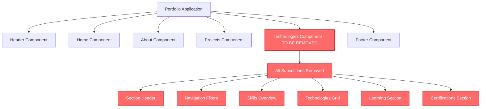

# Complete Technologies Section Removal Design

## Overview

This design document outlines the complete removal of the Technologies & Tools section from the Angular portfolio application. The user has requested to remove the entire section including all subsections, components, and associated functionality.

## Current Technologies Section Analysis

### Technology Stack & Dependencies

- **Frontend Framework**: Angular 19+ with TypeScript
- **Styling**: SCSS with CSS variables for theming
- **Component Architecture**: Standalone components with CommonModule
- **Animation**: AOS (Animate on Scroll) library integration

### Current Section Structure

The technologies section currently contains the following subsections:

#### 1. Section Header

- Title: "Tecnologias & Ferramentas"
- Subtitle: "Minha Stack Tecnológica"
- Description about modern web solutions

#### 2. Navigation Filters

- "Todas" (All)
- "Frontend"
- "Backend"
- "Ferramentas" (Tools)

#### 3. Skills Overview Statistics

- Total Technologies count
- Years of Experience (3+)
- Average Level percentage

#### 4. Technologies Grid

- Interactive technology cards with:
  - Technology icons
  - Proficiency levels (percentage)
  - Progress bars
  - Experience duration
  - Last used date
  - Related projects
  - Descriptions

#### 5. Learning Section

- Title: "Sempre Aprendendo" (Always Learning)
- Technologies currently being studied
- Progress indicators for learning technologies

#### 6. Certifications Section

- Title: "Certificações & Cursos"
- Certification cards with:
  - Institution logos
  - Certification names
  - Years obtained
  - Completion status

## Removal Scope

The complete removal includes:

### Entire Technologies Component

- Complete `TechnologiesComponent` removal
- All associated TypeScript logic and interfaces
- Complete HTML template removal
- All SCSS styling for the technologies section

### All Subsections Included in Removal

1. **Section Header** - Title, subtitle, and description
2. **Navigation Filters** - Category filter buttons (All, Frontend, Backend, Tools)
3. **Skills Overview Statistics** - Technology count, experience years, average level
4. **Technologies Grid** - All technology cards with icons, levels, progress bars
5. **Learning Section** - "Sempre Aprendendo" with learning technologies
6. **Certifications Section** - "Certificações & Cursos" with certification cards

### Data and Interfaces Removal

- `Technology` interface
- `LearningTechnology` interface
- `Certification` interface
- All technology data arrays
- All component methods and logic

## Complete Removal Architecture Impact

## Complete Removal Implementation Strategy

### File Deletion

- Remove entire component directory and all files
- Clean up imports and references across the application
- Update routing and navigation configuration

### Application Structure Updates

- Remove component from main app imports
- Update navigation menu to exclude technologies link
- Adjust scroll-to-section functionality
- Clean up unused assets and dependencies

## Implementation Steps

### Step 1: Remove Component Files

1. Delete the entire `technologies` component directory:
   - `src/app/components/technologies/technologies.component.ts`
   - `src/app/components/technologies/technologies.component.html`
   - `src/app/components/technologies/technologies.component.scss`

### Step 2: Update Application Structure

1. Remove TechnologiesComponent import from main app component
2. Remove technologies route from routing configuration
3. Update component declarations and imports

### Step 3: Update Navigation

1. Remove technologies link from header navigation
2. Update navigation menu component
3. Adjust scroll-to-section functionality
4. Update any breadcrumb or progress indicators

### Step 4: Clean Up Dependencies

1. Remove unused technology icons and assets
2. Clean up any technology-related utility functions
3. Remove associated SCSS variables or mixins
4. Update global styling if necessary

### Step 5: Test Application

1. Verify application compiles without errors
2. Test navigation flow works correctly
3. Ensure responsive design remains intact
4. Validate no broken links or references remain

## Impact Assessment

### Positive Impacts

- Simplified portfolio structure
- Reduced bundle size and load time
- Cleaner navigation flow
- Less maintenance overhead

### Considerations

- Technologies information will no longer be displayed
- Visitors won't see technical skills overview
- May need alternative way to showcase technical competencies
- Consider adding brief tech mentions in About or Projects sections
