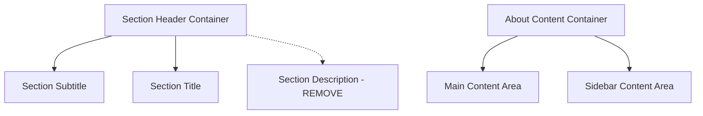

# About Section Content and Structure Improvements

## Overview

This design outlines improvements to the About section of the Angular portfolio application, focusing on content restructuring and HTML tag positioning fixes. The changes will simplify the section header content and ensure proper HTML structure alignment.

## Current State Analysis

The About section currently contains:

- Section subtitle: "Conheça mais sobre mim" ✓ (already correct)
- Section title: "Sobre Antonio Romes" ✓ (already correct)
- Section description: "Desenvolvedor apaixonado por criar experiências digitais excepcionais" (to be removed)
- Potential HTML tag positioning issues requiring adjustment

## Design Requirements

### Content Structure Updates

**Header Simplification**

- Maintain current subtitle: "Conheça mais sobre mim"
- Maintain current title: "Sobre Antonio Romes"
- Remove description paragraph: "Desenvolvedor apaixonado por criar experiências digitais excepcionais"
- Preserve AOS animation attributes for remaining elements

**HTML Structure Validation**

- Review and fix any misaligned or improperly nested HTML tags
- Ensure proper semantic structure is maintained
- Validate responsive layout integrity after changes

## Implementation Design

### Template Structure Changes



### Component Template Updates

**Modified Section Header Structure**

```html
<div class="section-header" data-aos="fade-up" data-aos-duration="1000">
  <span class="section-subtitle">Conheça mais sobre mim</span>
  <h2 class="section-title">Sobre Antonio Romes</h2>
  <!-- Remove section-description paragraph -->
</div>
```

**HTML Tag Positioning Fixes**

- Verify proper nesting of all container elements
- Ensure Angular structural directives (\*ngFor, data-aos) are correctly positioned
- Check alignment of opening and closing tags throughout the component
- Validate responsive grid structure integrity

### CSS Impact Assessment

**Styling Adjustments Required**

- Update `.section-header` spacing to accommodate removed description
- Maintain visual balance without description text
- Preserve responsive behavior across breakpoints
- Ensure consistent vertical rhythm with other sections

**Layout Considerations**

- Reduce top padding/margin if needed to compensate for removed content
- Maintain visual hierarchy between subtitle and title
- Preserve AOS animation timing and effects

## Testing Strategy

### Validation Checklist

- [ ] HTML structure validation using browser dev tools
- [ ] Responsive layout testing across breakpoints (mobile, tablet, desktop)
- [ ] AOS animation timing and effect verification
- [ ] Cross-browser compatibility testing
- [ ] Accessibility compliance verification (heading structure, semantic markup)

### Visual Regression Testing

- Compare before/after section spacing and alignment
- Verify smooth transitions between sections
- Ensure theme consistency (light/dark mode)
- Check typography scaling and readability

## Technical Considerations

### Component Architecture

- Changes limited to template file (about.component.html)
- No TypeScript component logic modifications required
- SCSS styling may need minor adjustments for spacing
- Preserve existing data binding and component methods

### Performance Impact

- Minimal performance impact (removing one DOM element)
- Faster initial render due to less content
- Maintained AOS library integration
- No additional dependencies required

### Accessibility Maintenance

- Preserve semantic heading structure (h2 for section title)
- Maintain proper ARIA attributes if present
- Ensure keyboard navigation compatibility
- Preserve screen reader friendly markup

## Browser Compatibility

**Supported Browsers**

- Modern browsers supporting CSS Grid and Flexbox
- Angular 19+ compatibility requirements
- AOS library browser support
- CSS custom properties support

**Responsive Breakpoints**

- Mobile: 320px - 767px
- Tablet: 768px - 1023px
- Desktop: 1024px+
